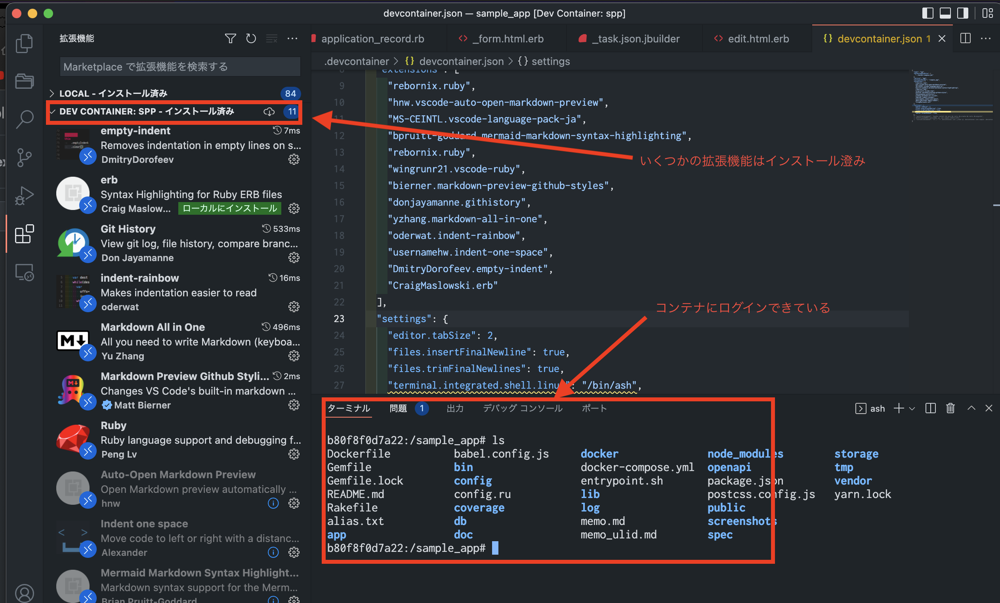

# vscode + docker

　今までは、docker desktip で アプリを動作させていた。

docker desktop はあにんストールして、Rancher Desktop をインストールした。
そして docker, doecke-desktop を動作させた。

さらに vscode に 拡張機能 "Remote Containers" をインストールし、~/.devcontainer/devcontainer.json を設定した。

これによって、 Mac 上のコンソールから code . としてから
reopen container  することで raisl アプリを起動できるようにできた。

## 参考情報

### docker
- <https://zenn.dev/koduki/articles/ba54daaba28f93>
  Docker Desktopの代替方法 - Windows and Mac編

- <https://qiita.com/hisato_imanishi/items/91d6881ff7c4d55b9ec4>
  [Mac環境] Docker Desktopの代替として何が最適か

- <https://knqyf263.hatenablog.com/entry/2022/02/01/225546>
  Docker DesktopからRancher Desktopに乗り換えてみた

- <https://qiita.com/sohei56/items/e3a911b6104ca6a704b5>
  Mac & Rancher Desktop で docker-compose を使えるようになるまで

- <https://qiita.com/moritalous/items/14d4099023981dcf4fd2>
  まるでDocker Desktop！！Rancher Desktopの登場です

### vscode

- <https://qiita.com/otsuky/items/f46f5ee9eb11b3a9a4ba>
  VSCodeの拡張機能・設定を共有してチームみんなでエンジョイナイスDX

- <https://www.mitsue.co.jp/knowledge/blog/frontend/202108/30_1016.html>
  Visual Studio Codeの設定ファイルを共有してチーム開発をより快適にする
  